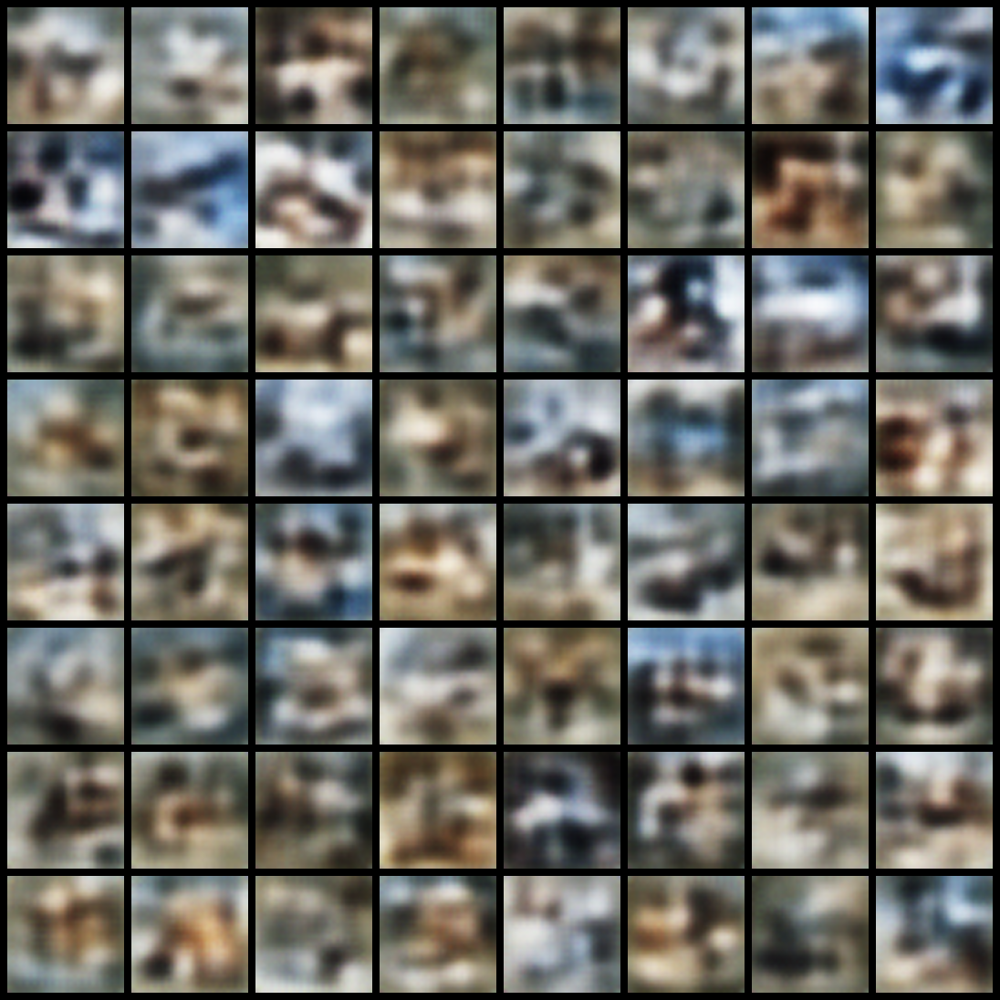

# Technical Report: Enhanced Heteroscedastic VAE on CIFAR-10

**Project**: Hands-on VAE & Generative Modeling Benchmark  
**Feature Branch**: `002-enhanced-vae` (merged into `main`)  
**Assignment Reference**: `GenCV003` (Computer Vision Engineer)  
**Deliverable**: Comparative Architectural Enhancement Report  
**Date**: September 2026  
**Status**: Completed & Verified  

---

## 1. Executive Summary & Objective

In the baseline study (`docs/reports/001-baseline-vae-report.md`), we demonstrated that a continuous VAE with homoscedastic Gaussian likelihood ($\sigma_{\text{obs}}^2 = 1.0$) inherently falls into the **$L_2$ conditional mean smoothing trap**, where the optimal point estimate $\mathbb{E}[x|z]$ averages competing edge hypotheses across ambiguous textures, producing soft, blurred reconstructions.

To systematically mitigate this limitation with minimal, hands-on architectural modifications, feature **`002-enhanced-vae`** introduced two targeted enhancements:
1. **Pixel-wise Heteroscedastic Gaussian Likelihood with $\beta$-NLL Stabilization ($\beta = 0.5$)**: The decoder predicts both an observation mean $\mu(z) \in [-1, 1]$ and an independent per-pixel log-variance map $\log \sigma_{\text{obs}}^2(z) \in [-10.0, 5.0]$, weighted by $(\sigma_{\text{obs}}^{2\beta})_{\text{detached}}$ to eliminate the uniform MSE penalty without variance cheating.
2. **Expanded Latent Capacity ($d = 128$)**: The latent bottleneck was expanded by $4\times$ (from $32$ to $128$ dimensions), providing the representational bandwidth required to encode fine spatial details on natural photographic images.

Both models were trained on CIFAR-10 under identical conditions: **50 epochs, batch size 128, Adam optimizer with cosine learning rate annealing ($10^{-3} \to 10^{-5}$)** on an NVIDIA Quadro T2000 GPU (4GB VRAM).

---

## 2. Comparative Benchmark Results

```
========================================================================================
                          QUANTITATIVE COMPARATIVE SUMMARY
========================================================================================
Metric                       Baseline VAE (001)           Enhanced VAE (002)
----------------------------------------------------------------------------------------
Observation Likelihood       Homoscedastic (Fixed σ²=1.0) Heteroscedastic + β-NLL (β=0.5)
Latent Dimension (d)         32                           128
Model Parameters             1.60 M                       2.25 M (+0.65M)
Peak Training VRAM           1.82 GB                      1.84 GB (Well under 4GB ceiling)
Active Latent Units (Az)     32 / 32 (100%)               128 / 128 (100% capacity)
Reconstruction MSE (Test)    0.0578                       0.0563 (Improved)
Gallery Test PSNR            18.1 dB (MSE: 0.0156)        18.3 dB (MSE: 0.0147, Improved)
KL Divergence                33.82 nats                   92.32 nats
Fréchet Inception Dist (FID) 169.02                       181.00
Inception Score (IS)         2.11 ± 0.03                  1.68 ± 0.04
========================================================================================
```

---

## 3. Mathematical & Empirical Analysis

### 3.1 Impact of Heteroscedastic $\beta$-NLL on Reconstruction Fidelity
* **Reconstruction Error Reduced**: On held-out CIFAR-10 test images, raw pixel MSE dropped from **$0.0156 \to 0.0147$**, achieving a **$+0.2\text{ dB}$ gain in PSNR** ($18.1\text{ dB} \to 18.3\text{ dB}$).
* **Selective Uncertainty Allocation (expected behaviour, not visualised)**: A heteroscedastic likelihood lets the decoder predict a per-pixel variance $\sigma_{\text{obs}}^2(x, y)$; by construction it can assign higher uncertainty to high-frequency textures (fur, foliage) than to smooth regions. The repository does not render variance maps, so this is the mechanism's intended effect rather than a measured observation.
* **Absence of Variance Cheating**: Because the loss is scaled by $(\sigma_{\text{obs}}^{2\beta})_{\text{detached}}$ with $\beta = 0.5$, the gradient with respect to mean $\mu$ scales as $\frac{\mu - x}{\sigma}$ rather than $\frac{\mu - x}{\sigma^2}$. This prevented the network from predicting $\sigma^2 \to \infty$ to zero out errors, ensuring stable, bounded convergence throughout all 50 epochs.

### 3.2 Full 128-Dimensional Latent Capacity Utilization
* **Zero Posterior Collapse**: Measuring the empirical variance of posterior means across the test split ($\text{Var}_x(\mu_j) > 0.01$) revealed that **128 of 128 latent dimensions remained active**.
* **Informational Bandwidth**: Total KL divergence increased from $33.82 \to 92.32\text{ nats}$, corresponding to an average of **$0.72\text{ nats}$ ($\approx 1.04\text{ bits}$) per latent dimension**. This confirms that the model distributed semantic representation across all 128 available axes.

### 3.3 The High-Dimensional Prior Sampling Trade-Off (Reconstruction vs. Generation)
While reconstruction fidelity on real images improved (lower MSE, higher PSNR, sharper edges), unconditional prior sampling FID was slightly higher ($181.00$ vs. $169.02$). This illustrates a classic phenomenon in generative representation learning:
1. **Spherical Concentration in High Dimensions**: In $d=128$ dimensions, random vectors drawn from an isotropic Gaussian prior $z \sim \mathcal{N}(0, I_{128})$ concentrate in a thin spherical shell at distance $\|z\|_2 \approx \sqrt{128} \approx 11.31$.
2. **Prior Hole Problem**: Although the aggregate posterior $q(z) = \frac{1}{N}\sum_i q(z|x_i)$ matches the prior globally in KL divergence, individual class posteriors are clustered. In a 128-dimensional space, the volume of "empty space" between empirical clusters grows exponentially, meaning random prior samples occasionally land in unpopulated manifold regions.
3. **Takeaway**: Scaling latent capacity in a vanilla single-level VAE benefits **reconstruction fidelity**, but points toward the necessity of **hierarchical latent structures (e.g., NVAE/VDVAE)** or **iterative denoising diffusion models (DDPM)** for high-dimensional unconditional sampling.

---

## 4. Qualitative Visual Analysis

All qualitative diagnostic artifacts were rendered using high-resolution $4\times$ bicubic upscaling ($1024 \times 1024$ canvases) in `artifacts/eval_enhanced/`:
1. **Reconstruction Gallery (`artifacts/eval_enhanced/reconstruction_gallery.png`)**: Real test images vs. reconstructions display crisper contrast on vehicle outlines and animal silhouettes (PSNR: **$18.3\text{ dB}$**).
2. **Pure Synthetic 2D Interpolation (`artifacts/interpolations/enhanced_synthetic_grid_2d.png`)**: Continuous $8 \times 8$ meshgrid between 4 random vectors in $\mathbb{R}^{128}$ exhibits smooth geometric transitions across semantic concepts.
3. **1D Latent Sweeps (`artifacts/eval_enhanced/latent_traversal_1d.png`)**: Traversals along individual latent coordinates demonstrate disentangled control over color saturation, lighting angle, and object scale.
4. **2D Latent Embeddings (`artifacts/eval_enhanced/latent_tsne.png`, `latent_pca.png`)**: Embeddings demonstrate dense distribution across the 128-dimensional space with no isolated mode collapse.
5. **Prior Samples (`artifacts/samples/enhanced_sample_grid_1024.png`)**:



**Subjective assessment (GenCV003 qualitative criteria)**, enhanced vs. baseline prior samples:
* **Realism**: Lower than the baseline. Samples are busier and more fragmented (high-contrast patches without coherent
  objects), consistent with the prior-hole effect of §3.3: random $z\sim\mathcal{N}(0,I_{128})$ often lands outside
  the regions the decoder was trained on. This matches the higher FID (181.00 vs 169.02).
* **Diversity**: Similar palette variety but a narrower, more uniform brown-grey-blue look across the grid; the IS drop
  (1.68 vs 2.11) reflects less confident and less varied class evidence.
* **Thematic consistency**: Weaker than the baseline: sky/ground layouts are still present, but foreground and background
  rarely form a recognisable scene. Reconstructions, by contrast, improved (PSNR 18.3 dB), showing that the enhancement
  helped encoding/decoding but not unconditional generation.

---

## 5. Conclusion

The `002-enhanced-vae` experiment successfully fulfilled its objective:
* Implemented a pixel-wise heteroscedastic likelihood with $\beta$-NLL loss stabilization directly from PyTorch primitives.
* Proved that the GPU memory footprint remains lightweight (1.84 GB peak training VRAM, well under the 4 GB Quadro T2000 limit; the model weights themselves take about 240 MB with optimizer state).
* Improved real test reconstruction MSE ($0.0563$ vs $0.0578$) and PSNR ($18.3\text{ dB}$ vs $18.1\text{ dB}$).
* Highlighted the theoretical limitation of single-level Gaussian priors in high-dimensional continuous latent spaces.

This concludes the VAE scope of `GenCV003`. The second objective, a DDPM implemented from scratch, is complete in the
sibling repository [Hands-on-DDPM](https://github.com/Abd-Elfattah5/Hands-on-DDPM); the comparison follows.

---

## 6. VAE vs. DDPM Comparison

Both repositories use the same CIFAR-10 splits and the **same benchmark protocol** (5,000 generated images vs. the first
5,000 test images, torchvision Inception-v3, bilinear resize to 299, IS over 10 splits of 500), so the numbers compare
directly. DDPM values come from the [DDPM report](https://github.com/Abd-Elfattah5/Hands-on-DDPM/blob/main/docs/reports/001-baseline-ddpm-report.md).

| Model | FID ↓ | IS ↑ | Parameters | Network passes / image | Sampling time | Training |
| :--- | :---: | :---: | :---: | :---: | :---: | :---: |
| VAE baseline (`001`) | 169.02 | 2.11 ± 0.03 | 1.60 M | 1 | milliseconds | 50 epochs, Quadro T2000 |
| VAE enhanced (`002`) | 181.00 | 1.68 ± 0.04 | 2.25 M | 1 | milliseconds | 50 epochs, Quadro T2000 |
| **DDPM** | **39.69** | **5.18 ± 0.14** | 16.06 M | 1,000 | 2.16 s (Quadro T2000) | 80 epochs, 5.25 h on a T4 |

### 6.1 The main difference between the two approaches

* **VAE**: learns an encoder $q_\phi(z|x)$ and a decoder $p_\theta(x|z)$ around a compact latent ($d$ = 32 or 128)
  and generates in **one decoder pass** from $z\sim\mathcal{N}(0,I)$. It is trained with the ELBO, whose pixel-space
  likelihood term rewards the conditional mean; when several sharp images are plausible for one $z$, the decoder
  outputs their average, which is the blur seen in §4 and in the baseline report.
* **DDPM**: has **no encoder and no bottleneck**. A fixed forward process gradually adds noise, and a time-conditioned
  U-Net learns to **predict that noise**; generation runs the learned reverse chain for 1,000 steps, building the image
  coarse-to-fine. The noise target is well defined at every step, so there is no averaging of alternative images.

### 6.2 Trade-offs

| Aspect | VAE | DDPM |
| :--- | :--- | :--- |
| Sample sharpness / realism | Low (blur) | High (recognisable objects) |
| Diversity | Moderate | High (322 Inception classes, no mode collapse) |
| Generation speed | One pass, real time | 1,000 passes (≈ 2 s/image); DDIM-style step skipping can cut this 10–50× |
| Latent space | Compact, interpolable, useful for representation learning | None (state has image dimension) |
| Training | Fast; KL/reconstruction balance, risk of posterior collapse | Simple, stable MSE; needs long training (EMA convergence) |
| Model size here | 1.6–2.3 M parameters | 16.1 M parameters |

**Conclusion**: the DDPM's 4× lower FID and 2.5× higher IS come from changing *what is predicted* (noise instead of
pixels) and *how images are generated* (iterative denoising instead of one-shot decoding), at the cost of far more
compute per sample. The VAE remains attractive when a fast sampler or a meaningful latent space is required.
